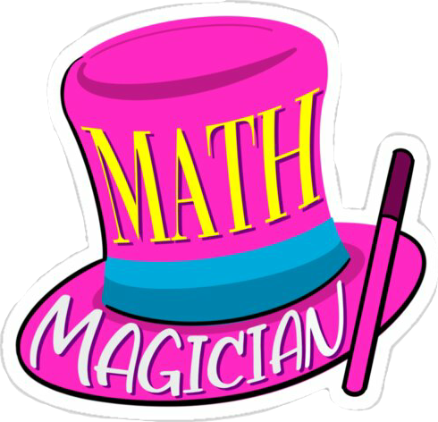

<a name="readme-top"></a>

<div align="center">
    
    <h1><b>Math Magicians</b></h1>
</div>

---

<!-- TABLE OF CONTENTS -->

# 📗 Table of Contents

- [📖 About the Project](#about-project)
  - [🛠 Built With](#built-with)
    - [Tech Stack](#tech-stack)
    - [Key Features](#key-features)
- [💻 Getting Started](#getting-started)
  - [Setup](#setup)
  - [Prerequisites](#prerequisites)
  - [Install](#install)
  - [Usage](#usage)
  - [Run tests](#run-tests)
  - [Deployment](#deployment)
- [👥 Authors](#authors)
- [🔭 Future Features](#future-features)
- [🤝 Contributing](#contributing)
- [⭐️ Show your support](#support)
- [🙏 Acknowledgements](#acknowledgements)
- [📝 License](#license)

---

<!-- PROJECT DESCRIPTION -->

# 📖 Math Magicians <a name="about-project"></a>

**Math Magicians** is a website for all fans of mathematics. It is a Single Page App (SPA) that allows users to:

- Make simple calculations.
- Read a random math-related quote.

---

#### Learning objectives

- Use React components.
- Use React props.
- Use React state.
- Use React routes.

---

## 🛠 Built With <a name="built-with"></a>

### Tech Stack <a name="tech-stack"></a>

  <ul>
    <li>
      
      <a href="https://react.dev/">React.js</a>
    </li>
    <li>
      
      <a href="https://developer.mozilla.org/en-US/docs/Web/JavaScript">JavaScript</a>
    </li>
    <li>
      
      <a href="https://developer.mozilla.org/en-US/docs/Web/HTML">HTML</a>
    </li>
  </ul>

---

<!-- Features -->

### Key Features <a name="key-features"></a>

- **SPA website**

<p align="right">(<a href="#readme-top">back to top</a>)</p>

---

<!-- GETTING STARTED -->

## 💻 Getting Started <a name="getting-started"></a>

To get a local copy up and running, follow these steps.

### Prerequisites

In order to run this project you need:

### Setup

Clone this repository to your desired folder:

Example commands:

```bash
  cd math-magicians
  git clone https://github.com/maximoortelli/Math-magicians.git
```

### Install

Install this project's dependencies with:

- npm install

### Usage

To run the project, execute the following command:

```bash
 npm run start
```

Runs the app in the development mode.\
Open [http://localhost:3000](http://localhost:3000) to view it in your browser.

The page will reload when you make changes.\
You may also see any lint errors in the console.

### Run tests

```bash
  npm test
```

Launches the test runner in the interactive watch mode.\
See the section about [running tests](https://facebook.github.io/create-react-app/docs/running-tests) for more information.

<p align="right">(<a href="#readme-top">back to top</a>)</p>

---

<!-- AUTHORS -->

## 👥 Authors <a name="authors"></a>

👤 **Author1**

- GitHub: [@maximoortelli](https://github.com/maximoortelli)
- LinkedIn: [Maximo Ortelli](https://www.linkedin.com/in/maximo-ortelli-rueda-265228203/)

<p align="right">(<a href="#readme-top">back to top</a>)</p>

---

<!-- FUTURE FEATURES -->

## 🔭 Future Features <a name="future-features"></a>

- [ ] **Improve Calculator style**

<p align="right">(<a href="#readme-top">back to top</a>)</p>

---

<!-- CONTRIBUTING -->

## 🤝 Contributing <a name="contributing"></a>

Contributions, issues, and feature requests are welcome!

Feel free to check the [issues page](https://github.com/ITurres/math-magicians/issues).

<p align="right">(<a href="#readme-top">back to top</a>)</p>

---

<!-- SUPPORT -->

## ⭐️ Show your support <a name="support"></a>

Give a ⭐ if you liked this project!

<p align="right">(<a href="#readme-top">back to top</a>)</p>

---

<!-- ACKNOWLEDGEMENTS -->

## 🙏 Acknowledgments <a name="acknowledgements"></a>

I thank Microverse for this fantastic opportunity.

<p align="right">(<a href="#readme-top">back to top</a>)</p>

---

<!-- LICENSE -->

## 📝 License <a name="license"></a>

This project is [MIT](./LICENSE) licensed.

<p align="right">(<a href="#readme-top">back to top</a>)</p>

---
